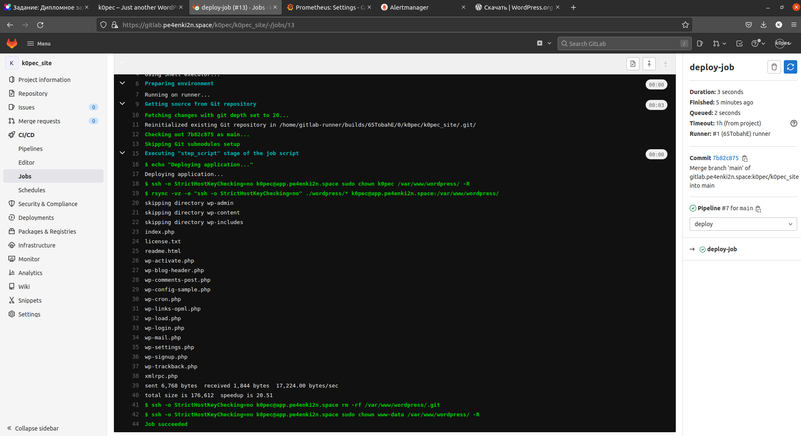

# Diplom Work

### 1. Регистрация доменного имени
+   Домен зарегистрирован у регистратора REG.RU
>
+   Доменная зона делегирована в Yandex Cloud, A-записи создаются динамически Terraform
>

### 2. Создание инфраструктуры
+   Создан сервисный аккаунт
>
+   Перед развертыванием необходимо:
    - добавить в окружение перемкенную $YC_TOKEN
    ```bash
        export YC_TOKEN=<YouToken>
    ```

    - сгенерировать ssh ключи для фронт машины и машин за NAT и добавить public key в файл meta.txt в каталоге terraform

+   Инфраструктура разворачивается из каталога terraform командой 
```bash
    terraform apply --auto-approve
```
>  
>

### 3. Настройка инфраструктуры
+   Настройка производится Ansible из каталога terraform командой
```bash
    ansible-playbook -i ../ansible/hosts ../ansible/<playbook_name>.yml
```
+   Файл hosts формируется динамически при работе Terraform
+   Очередность запуска playbook (плейбуки и роли расположены в каталоге ansible):  
    -   ***ping*** - проверяет доступность хостов для запуска настройки (запускается перед всеми ролями)
    1) ***front*** - разворачивает и конфигурирует на фронтовой машине Nginx и NodeExporter, получает сертификаты SSL для сервисов, доступных снаружи, разворачивает proxy для доступа в интерент машин за NAT;
    2) ***MySQL*** - разворачивает два сервера MySQL c репликацией master-slave;  
    3) ***wordpress*** - разворачивает WordPress на сервере приложений;
    >  
    4) ***gitlab*** - разворачивает GitLab;  
    >
    >
    >
    5) ***runner*** - разворачивает Gitlab-Runner;
    >  
    >  
    >  
    6) ***NodeExporter*** - разворачивает NodeExporter на машинах, кроме фронтовой;
    7) ***monitoring*** - разворачивает Prometheus, Grafana, Alertmanager.  
    >
    >
    >

